# CSC317H1F Showcase: "Painted"
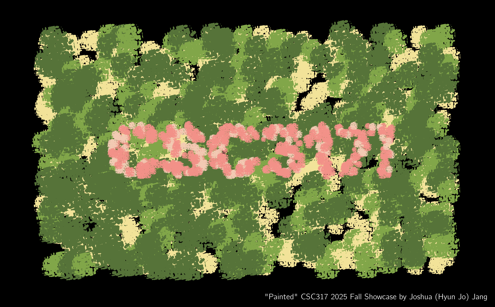

## Information
- Title: Painted
- Full Name: Joshua (Hyun Jo) Jang
- UTORid: janghy16
- Student ID: 1006853362
- Assignment Number: A6 (Shader Pipeline)

## Installation & Running The Showcase
Compilation and execution was confirmed on an Apple M1 Pro machine running macOS 26.1.

- Download the entire repository
- Create a build directory (`mkdir ./build`)
- Enter the build directory (`cd ./build`)
- Configure CMake (`cmake ../`)
- Compile from source (`make`)
- Run the executable using the showcase data files (within the build directory, run: `./shaderpipeline ../data/showcase.json ../data/showcase.obj`)

## List of Features Added
- Handcrafted paint-like alpha masks generated from Voronoi noise, implemented in GLSL (src/painterly.fs)
- Stylised toon shading, implemented in GLSL (src/painterly.fs)
- Custom-modelled scene geometry using Blender geometry nodes (data/showcase.obj)
- Combined all of the above for a painterly render of a “CSC317!” scene
- Minor modifications to `main.cpp`, `mesh_to_vao.h`, `pass-through.vs`, `pass-through.tcs`, `pass-through.tes` and the addition of `tiny_obj_loader.h` to allow OBJ file reading and the passing of UV + normals to the fragment shader (to speed up implementation, I have used an external library (`tiny_obj_loader.h`) and its sample code at: https://github.com/tinyobjloader/tinyobjloader

## Background
I love non-photorealistic rendering (NPR). There is a certain charm to stylised 3D work that often makes them timeless (see [The Legend of Zelda: The Wind Waker](https://en.wikipedia.org/wiki/The_Legend_of_Zelda:_The_Wind_Waker) from 2002!), which is, in my opinion, much more difficult to achieve in photorealistic rendering. Therefore, following my previous NPR projects such as [METRO](https://musicofmusix.github.io/metro), in this short showcase for CSC317 I thought to try something new but still within the realms of NPR.

A subgenre of NPR is what is called “painterly rendering”. This involves techniques to make a 3D render or photograph look like it was painted by hand using watercolour, oil, etc. A personal favourite of mine is the [Kuwahara filter](https://en.wikipedia.org/wiki/Kuwahara_filter). However, I found that many of these techniques were not 100% convincing, and producing a good-looking result would involve a lot of *acutal* handcrafted work (Arcane, a 3D animated show, had most of its [background scenes drawn by hand](https://www.artstation.com/artwork/034KX4)). So when I saw this [Reddit post](https://www.reddit.com/r/blender/comments/1pb1i7p/no_lights_all_phong/) 5 days ago, I was beyond shocked to see how real it looked (as a painting):

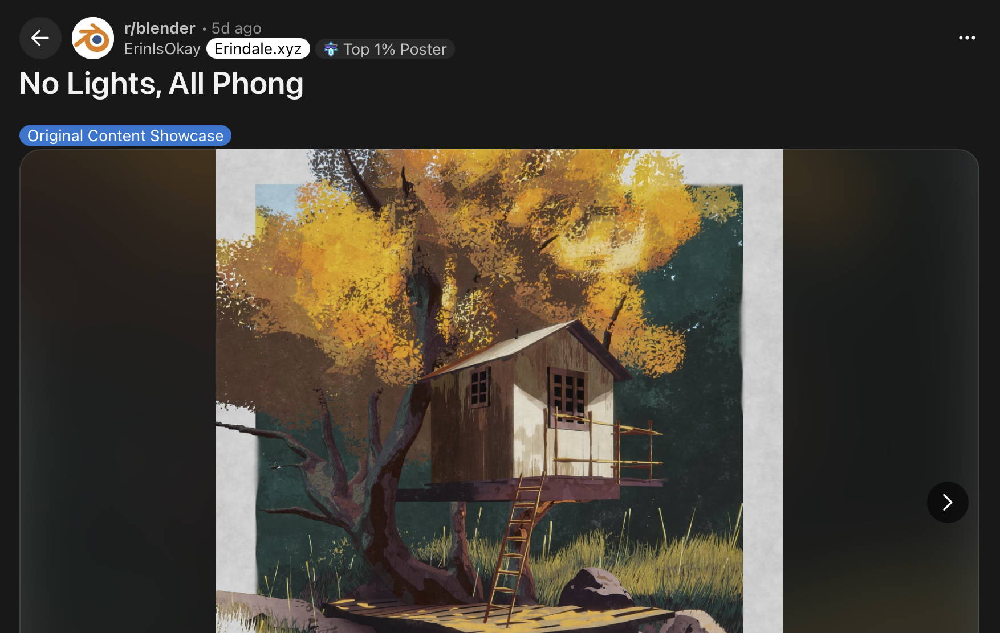

I just had to try this technique out for myself. The author of the post mentioned 2 key points: classical n-dot-l shading (hello lecture 3) and Voronoi-driven paint-like alpha masks. The former is straightforward, but what about the latter? (Voronoi noise)[https://en.wikipedia.org/wiki/Worley_noise] is a pseudorandom function that can be used as a “seed” to create interesting, natural looking patterns after some manipulation, much like our Perlin noise implemented for A6. It seemed like the paint-like “blobs” were created using Voronoi noise. That sounded simple enough, so here began my journey…

## Blender Proof-of-Concept
My goal is to create a small scene with the text “CSC317!” using this painterly rendering technique. This means three main sub-objectives:
- Creating the Voronoi-driven alpha mask to produce a paint-like blob
- Using n-dot-l shading to compute a colour to apply to that mask
- Creating the geometry

Before diving straight into the GLSL and C++, Let’s first try all three in Blender for quick prototyping.

### Voronoi-Driven Alpha Mask

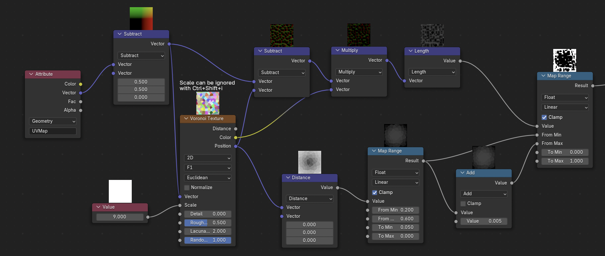

This Blender shadergraph segment is all that is needed to produce a binary mask. We use the UV barycentric coordinates of a simple 1x1 plane object and us that as input to a Euclidian distance-based Voronoi noise function. Then, its outputs are weighted by their distance from the UV origin, such that we get a circular “blob” at the end. Add some simple arithmetic massaging, and we get a black-and-white paint-like pattern at the end!

### n-dot-l Toon Shading

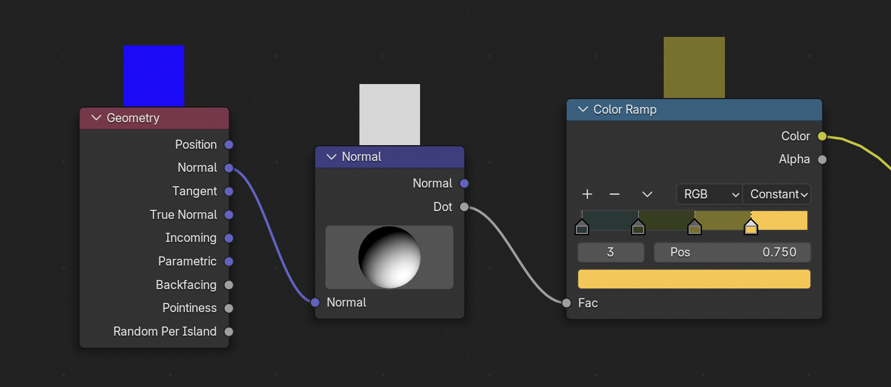

In class, we covered Lambertian n-dot-l shading as a simple technique for smooth, continuous lighting of diffuse objects. But it can also be used for perhaps the most commonly used technique in NPR: [toon (or cel) shading](https://en.wikipedia.org/wiki/Cel_shading). Instead of smoothly transitioning shades from a lit to an unlit region, we use a step function that sets hard step thresholds and maintains a constant value at each step. This results in a discrete and limited colour palette, which gives off the “cartoon” look. Since we are going for a painterly effect, toon shading is a perfect choice. Therefore, in the above shadergraph we simply take the normal, do traditional n-dot-l shading, and take the resulting scalar as the parameter for our step (“colour ramp”) function.

Combining the alpha masks and colours, and applying them on a bunch of square plane meshes, we get normal-dependent, paint-like blobs in 3D space:

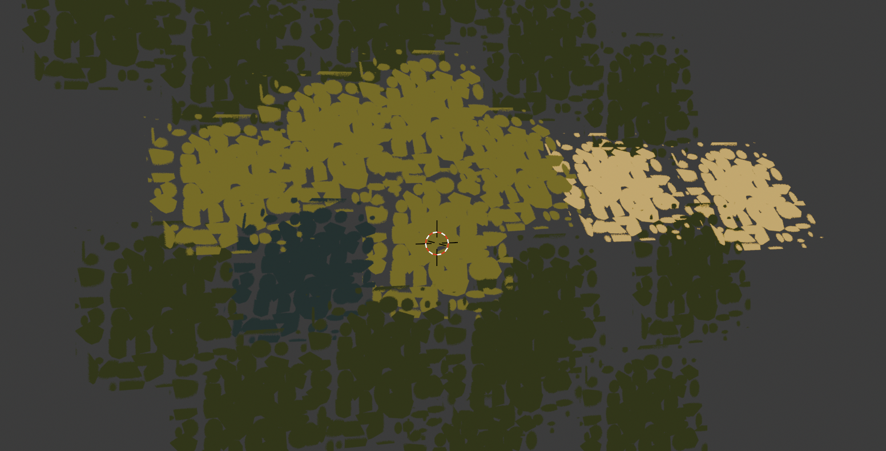

### Geometry
A major technique used by the original Reddit author was to apply these paint-like blobs to multiple square plane objects scattered and stacked on top of each other, to create a “layered paint” effect. Clever!

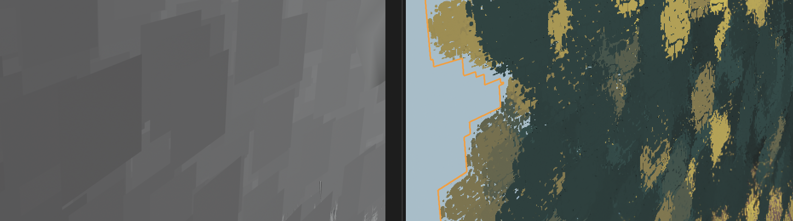

But we are definitely NOT going to create, position, and rotate hundreds of planes manually. In fact, Blender has a great solution for these procedual, randomised patterns: Geometry Nodes. Like shadergraph nodes, they allow us to feed in a single instance of a plane, and scatter them however they like!

We first prepare a single plane object, and a flat mesh created from text, using Blender’s text tool:

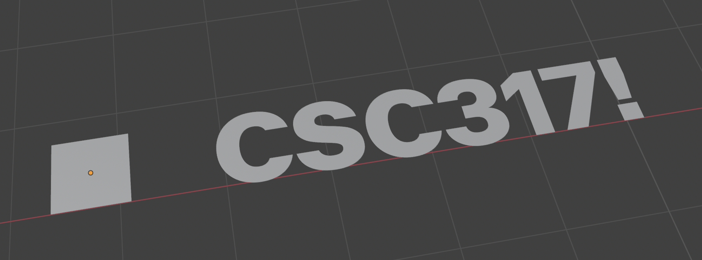

Then, we simply tell Blender to “randomly scatter the plane following the shape of the text mesh, with randomised scale and rotation offsets”, in geometry nodes:

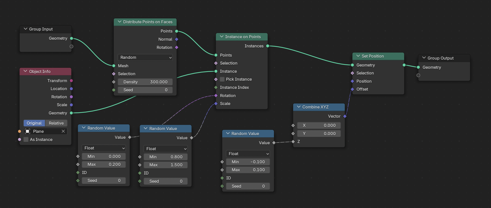
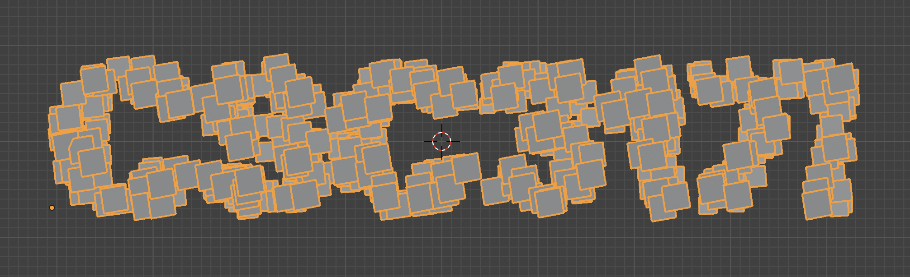

A large background plane can be added using the same method:

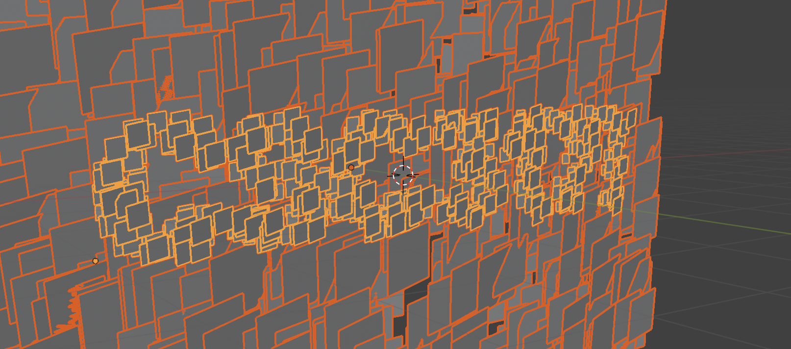

Now, we have all the components needed for implementation in code!
## Modifying A6
We will be modifying Assignment 6: Shader Pipeline, as it already provides many of the groundwork and most of our work will simply involve opening the geometry OBJ file exported from Blender, and creating a new fragment shader (FS) that implements our paint-like blobs.

The original A6 implementation went something like this: In main.cpp (CPU), create an icosahedron (polyhedron “sphere”) and send its vertices and faces to the vertex shader (VS) - tessellation control shader (TCS) - tessellation evaluation shader (TES) - FS chain where we decorated a planet and its moon.

This all seems very standard, but there was a simplification trick used during all of this: we were dealing with *spheres*. This meant that we did not need to pass along normals through the VS-TCS-TES-FS chain, as the surface position = normal. It also meant that no UV coordinates had to be passed either, as we assumed a single type of geometry.

But now, we are dealing with an arbitrary mesh file (OBJ) with an arbitrary number of planes, each with their own normal and UV coordinates.

### Adding an OBJ Reader
The first modification is to add OBJ file reading functionality. Thankfully, [tinyobjloader](https://github.com/tinyobjloader/tinyobjloader) (`tiny_obj_loader.h`) on GitHub is a simple drop-in method. We can simply use its provided sample code, as well as edit `main.cpp` and `mesh_to_vao.h` to send vertices, faces, UVs, and normals to the GPU.

### Passing UV and Normal Information to the FS
Once at the GPU, we simply send the information all the way to the FS, by adding simple pass-through code in the VS, TCS, and TES.

We also send position information in object coordinate space (alongside projected positions), such that we can apply conditional colours in the fragment shader.

## The Fragment Shader (`painterly.fs`)
### Voronoi-Driven Alpha Mask

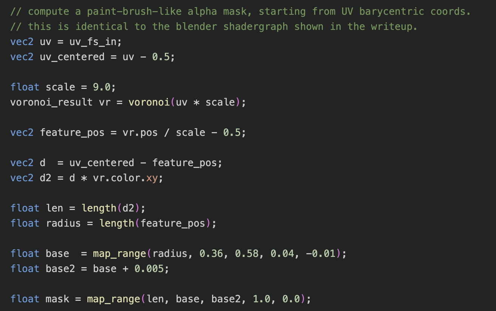

While we do work in GLSL this time, the core logic is exactly the same as the Blender shadergraph implementation. We have UVs sent from the CPU and previous shaders, and the Voronoi function (implemented in the same file) acts as the “seed”.

### n-dot-l Toon Shading

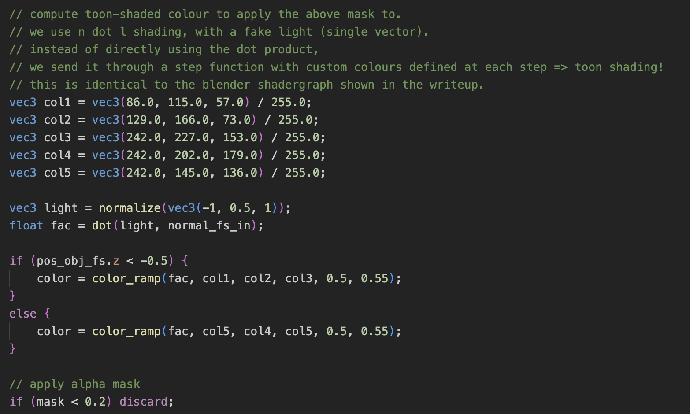

The toon shading logic was simple in the shadergraph, so it is also simple here. However, unlike in Blender, we do not have access to “object ID” information which tells us whether the current fragment belongs to the “CSC317!” text or the background! But fret not, as we have object-space positions. In Blender, we have positioned the text in front of the background, with a significant gap in between. All objects are also axis-aligned to the XY plane. That means, we can simply look at  Z coordinate value to determine the object we are dealing with! Using this, we apply green/yellow toon shades to the background, and pink shades to the text.

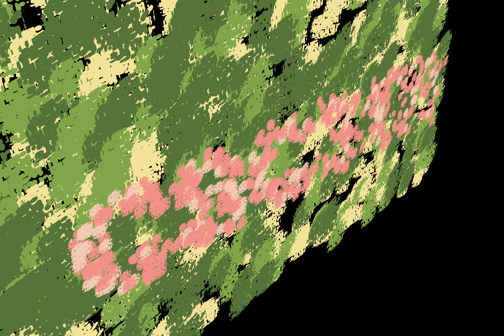

## Acknowledgements
- Reddit user u/ErinIsOkay’s post: https://www.reddit.com/r/blender/comments/1pb1i7p/no_lights_all_phong/ for the original inspiration
- Blender Foundation for the incredible free tool that is Blender: https://www.blender.org/
- The tinyobjloader library: https://github.com/tinyobjloader/tinyobjloader
- And of course, the CSC317 instructors and TAs :)